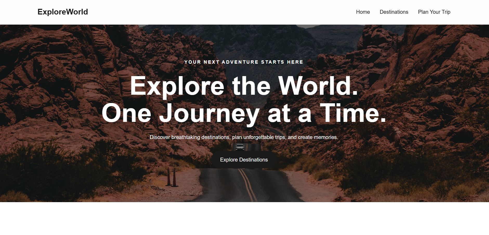
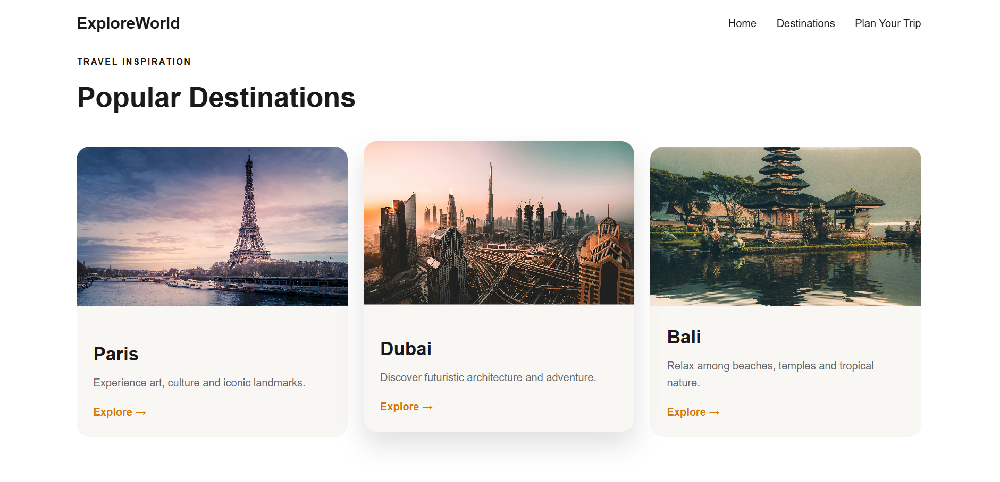

# 🌍 ExploreWorld — Tourism Portal

ExploreWorld is a responsive tourism and trip-planning website built as part of my **21-Day Web Development Challenge**.

The project focuses on building a clean travel landing page using only HTML and CSS while practicing semantic HTML, Flexbox, CSS Grid, responsive design, hover effects, forms, and Git/GitHub.

## 📸 Preview

### Home Page

### Destinations

## ✨ Features

- Responsive navigation bar
- Hero section with travel background image
- Dark image overlay for better text readability
- Popular destinations section
- Destination cards with hover animations
- Image zoom effect on card hover
- Trip planning form
- HTML form validation using `required`
- Responsive layout for mobile devices
- Smooth scrolling navigation
- Sticky navigation bar

## 🛠️ Technologies Used

- HTML5
- CSS3
- Flexbox
- CSS Grid
- Responsive Design
- Git & GitHub

## 📚 Concepts Learned

### HTML
- Semantic elements: `header`, `nav`, `main`, `section`, `article`, `footer`
- Links and navigation using `<a>`
- Forms and input types
- HTML form validation using `required`
- Image accessibility using `alt`

### CSS
- Box model
- Flexbox
- CSS Grid
- Media queries
- Pseudo-elements
- `position: relative` and `position: absolute`
- `z-index`
- `inset`
- `rgba()` transparency
- Hover and focus states
- Transitions and transforms
- `overflow: hidden`
- Border radius
- Background images

