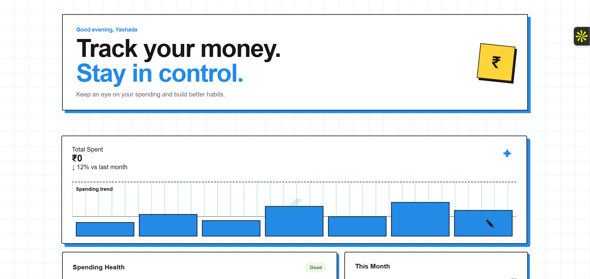
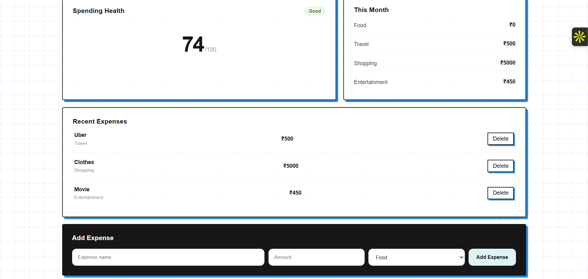
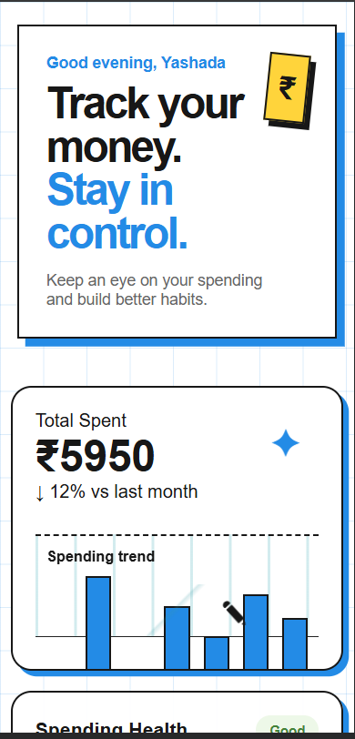

# Day 05 — Expense Tracker

A responsive expense tracking web app built using HTML, CSS, and JavaScript.

## Live Demo

[View Expense Tracker Live](https://expensetracker-rouge-ten.vercel.app/)

## Features

- Add expenses
- Delete expenses
- Calculate total spending
- Category-wise spending totals
- Form validation
- LocalStorage persistence
- Dynamic spending graph
- Responsive design

## Screenshots

### Dashboard

### Expense Tracking

### Mobile View

## Tech Stack

HTML • CSS • JavaScript • LocalStorage

Part of the 21-Day Web Development Challenge — Day 05/21